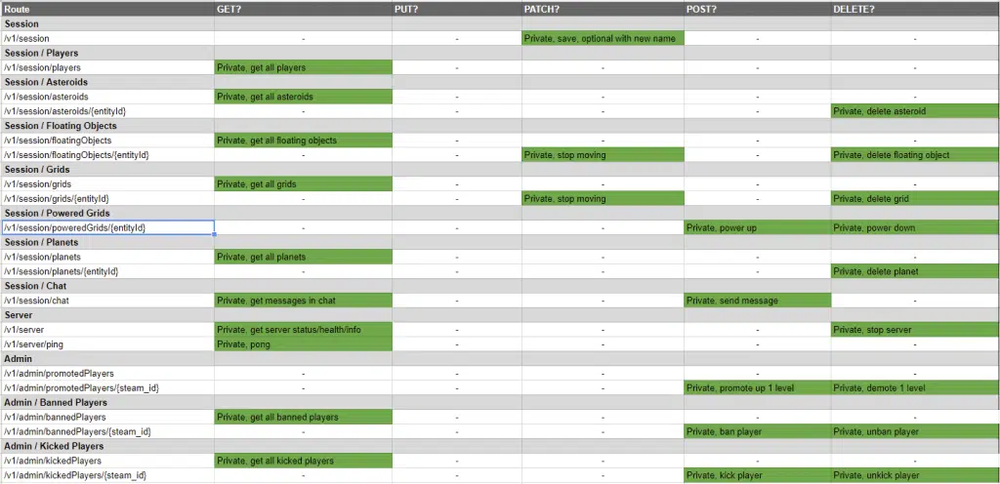

# go-vrage

[](https://github.com/space-engineers-tools/go-vrage/blob/main/LICENSE)
[](https://github.com/space-engineers-tools/go-vrage/releases)
[](https://pkg.go.dev/github.com/space-engineers-tools/go-vrage)
[](https://github.com/space-engineers-tools/go-vrage)

**go-vrage** is a Go client for the VRage Remote API, which is used by Space Engineers 1 [Dedicated Servers](https://www.spaceengineersgame.com/dedicated-servers) to expose server management functionality over HTTP.

> [!WARNING]
> This project is in an early development stage. **Breaking changes** may be introduced without prior notice. Use in production environments is strongly **discouraged**. When the first stable release is published, this notice will be removed.

## Compatibility with Space Engineers

Tested with

[](https://steamdb.info/patchnotes/24555733/)
<!-- Please use https://www.epochconverter.com/ to calculate the UTC timestamp for the time given on https://steamdb.info/app/244850/patchnotes -->

## API Coverage

| Root Endpoint | Coverage                                                        |
| ------------- | --------------------------------------------------------------- |
| /v1/server    |   |
| /v1/admin     |   |
| /v1/session   |   |

<details>
<summary>Click to see an image of all endpoints</summary>

This is a copy of an image provided at <https://www.spaceengineersgame.com/dedicated-servers>.



</details>

## Features

- Request authentication (nonce + HMAC-SHA1 signature).
- Flexible usage styles:
  - High-level typed clients via `Client.Server`, `Client.Session`, `Client.Admin`.
  - Low-level response access via `HTTPClient` methods (like `HTTPClient.GetV1ServerPing`) when you need more control.
- Sentinel error types for better error handling.

## Installation

To install the package to your Go module, run the following command:

```bash
go get github.com/space-engineers-tools/go-vrage
```

## Usage

Please check out the [examples](/examples) directory for usage examples.

## Contributing

We welcome contributions! Please read our [contributing guidelines](CONTRIBUTING.md) for details on how to get started.

## Links

- [Usage Examples](/examples)
- [Space Engineers Dedicated Servers Docs](https://www.spaceengineersgame.com/dedicated-servers)

## Disclaimer

This project is not affiliated with [Keen Software House](https://www.keenswh.com) or the [Space Engineers](https://www.spaceengineersgame.com) game.
